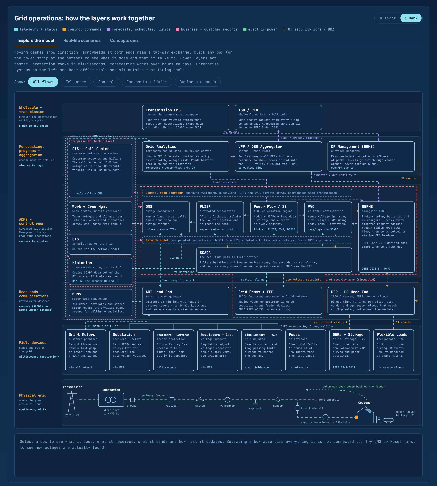

# Grid Operations: How the Layers Work Together

> **This project has moved.** It is now chapter 4, *Grid operations*, of the [Grid Field Guide](https://github.com/franklan-pm/grid-field-guide), live at **https://franklan.net/apps/04-grid-operations/**. This repo is archived, and its old web address forwards there. The text below describes the original version.

This is an interactive, single-page learning tool that explains how a modern electric distribution utility's systems fit together. It has three tabs. **Explore the model** is a layered diagram running from wholesale markets and forecasting down through the ADMS control room, head-ends and field devices to the physical power path, with animated data flows. **Real-life scenarios** steps through five situations (heat wave peak, storm outage, sunny spring midday, planned maintenance, grid emergency) and lights up only the parts involved at each step. **Concepts quiz** has 50 multiple-choice questions with explanations, each linked back to the relevant parts of the diagram.

It is written for people who work in or around electric utilities and already know the basic equipment (reclosers, regulators, meters, substations) but want to understand how the operational and IT systems connect: what OMS, FLISR, SCADA, DERMS, MDMS and the rest each do, what data moves between them, how fast, and why. It also works as an onboarding reference for engineers, analysts, IT staff and project team members new to grid modernization.

Technically, the whole tool is one self-contained HTML file with no build step, server or framework. The diagram is an inline SVG generated at load time by plain JavaScript from data arrays at the top of the script: `NODES` (boxes and their descriptions), `FLOWS` (connections as SVG paths, tagged by type), `BANDS` (the timing layers), `SCEN` (scenario steps) and `QUIZ` (questions, with the correct answer listed first and shuffled for display). Scenario steps and quiz questions refer to boxes by ID and to flows by endpoint pairs such as `"scada|flisr|ctl"`, so content can be added or edited without touching layout code. Colors are CSS custom properties with light and dark sets. The light/dark preference and quiz progress are saved in the browser's localStorage, and the only external resource is Google Fonts, with system fonts as a fallback when offline.

## What changed from the first version

- **Demand response no longer points at SCADA.** DR events now travel from the DR management system to a DER + DR head-end (vendor and aggregator clouds) and on to flexible loads.
- **Analytics reads history, not live SCADA.** A historian in the DMZ copies SCADA data out of the OT zone; Analytics also reads MDMS. Its forecasts go to power flow, the VPP and DR, not to SCADA.
- **Re-layered.** MDMS moved to the enterprise column, since it is a back-office application. DERMS moved up beside ADMS. The head-end band now holds only true gateways: AMI, SCADA comms/FEP, and DER/DR communications.
- **DERMS now gets feeder limits** from the new power flow / state estimation engine, the calculation core that FLISR, VVO and DERMS all depend on.
- **Two-way links fixed.** OMS pings meters (down) and gets last gasps (up); FLISR reports switching changes to OMS; the VPP and ISO exchange bids and dispatch.
- **Added:** control room operator, CIS + call center, work + crew management, GIS as the model source, transmission EMS, ISO/RTO market, substations, regulators + cap banks, fuses, flexible loads, the OT security boundary, and a physical power strip.
- **AMI timing corrected.** 15-minute intervals are recorded but delivered in batches; only outage events arrive in seconds.
- **New features since v2:** the Real-life scenarios tab, the Concepts quiz tab, and a light/dark mode toggle.
